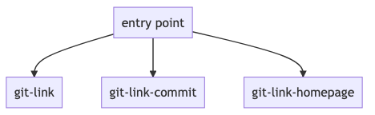
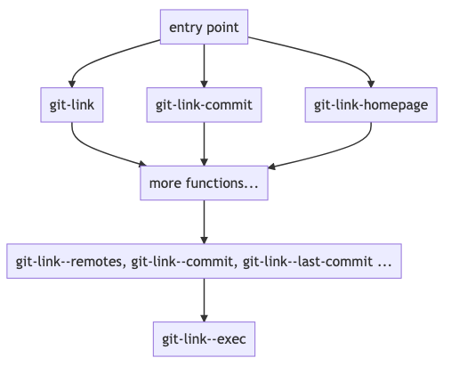

# Table of Contents

1.  [git-link](#org148f832)
    1.  [github link to the package](#org3e16757)
    2.  [A little background](#orgfdce510)
    3.  [Top Down Entrypoints](#org3cae6a1)
    4.  [Bottom up arch](#org9efa0bd)
        1.  [The ABSOLUTE bottom: git-link&#x2013;exec](#orgd76b738)
    5.  [one entry: git-link-homepage](#org9ef3740)
        1.  [interactive with a list.](#org04d362c)
        2.  [git-link&#x2013;select-remote](#org553314c)
        3.  [cadr](#org3a82b95)
        4.  [git-link&#x2013;new](#orge4fee61)
    6.  [git-link&#x2013;handler](#org806b603)
    7.  [Fun Extension](#org6f97241)

# git-link

## [github link to the package](https://github.com/sshaw/git-link)

Or you can always use `M-x find-library` or `C-h f git-link` to jump to the library

## A little background

I use this package daily at work to get the github url of the file + line number at point.

This is walkthrough is by no means exhastive, i already have some elisp and programming experience, but not an expert. I write down things that i am not familiar or have to check out during my reading of the library.

## Top Down Entrypoints

look for [autoload](https://www.gnu.org/software/emacs/manual/html_node/elisp/Autoload.html) - this auto exports functions and fake the behavior as if the whole file has been loaded. The file is actually loaded for the first time when you invoke the function.

there are three autoload functions in git-link

    ;;;###autoload
    (defun git-link (remote start end) ;; link to file
    ;;;###autoload
    (defun git-link-commit (remote) ;; link to commit
    ;;;###autoload
    (defun git-link-homepage (remote) ;; link to homepage.

## Bottom up arch

These autoload commands are ultimately powered by `git` commands.

Depending on where you call the commands, the `default-directory` is automatically set as the working directory.

`git-link` has the following relatively low level (close to git) functions:

- (defun git-link&#x2013;exec(&rest args)
- (defun git-link&#x2013;get-config (name)
- (defun git-link&#x2013;remotes ()
- (defun git-link&#x2013;last-commit ()
- (defun git-link&#x2013;commit ()
- (defun git-link&#x2013;current-branch ()
- (defun git-link&#x2013;repo-root ()
- (defun git-link&#x2013;remote-url (name)
- (defun git-link&#x2013;branch-remote (branch)

### The ABSOLUTE bottom: git-link&#x2013;exec

This function is the interface with git command.

    (defun git-link--exec(&rest args)
      (ignore-errors
        (with-temp-buffer
          (when (zerop (apply #'process-file "git" nil (current-buffer) nil args))
            (goto-char (point-min))
            (cl-loop until (eobp)
                     collect (buffer-substring-no-properties
                              (line-beginning-position)
                              (line-end-position))
                     do (forward-line 1))))))

1.  [`ignore-errors`](https://www.gnu.org/software/emacs/manual/html_node/elisp/Handling-Errors.html)

    Returns nil when encounter exception.

2.  `process-file` function

    This function runs a git command and print output into a buffer

    - zerop to check exit code is 0 (success), which is [bash convention](https://tldp.org/LDP/abs/html/exit-status.html).
    - use apply instead of call `process-file` directly b/c the dynamic list of args, [as long as the last parameter is a list](https://stackoverflow.com/questions/3862394/when-do-you-use-apply-and-when-funcall).
    - cl-loop collects the output into a list.
    - use `buffer-substring-no-properties` if you are ONLY interested in the text.

3.  examples

        ;; this is the same output as =git remote= and collect each line of output as element in a list.
        (git-link--exec "remote") ;; => ("origin") since i only have one remote

    Try out process-file function, this `C-c C-c` should switch you to a buffer `test-1` with the output of &ldquo;git remote&rdquo;, make sure invoke this in a git project.

        (let ((buf (get-buffer-create "test-1")))
          (switch-to-buffer buf)
          (process-file "git" nil (current-buffer) nil "remote"))

## one entry: git-link-homepage

This method jumps to the github homepage of the current git project.

I set `(setq git-link-open-in-browser t)` so that this funtion jumps to chrome.

    ;;;###autoload
    (defun git-link-homepage (remote)
      "Create a URL for the current buffer's REMOTE repository homepage.
    The URL will be added to the kill ring.  If `git-link-open-in-browser'
    is non-nil also call `browse-url'."

      (interactive (list (git-link--select-remote)))
      (let* ((remote-url (git-link--remote-url remote))
             (remote-info (when remote-url (git-link--parse-remote remote-url)))
             (base (car remote-info)))
    ...
        (if remote-info
    	;;TODO: shouldn't assume https, need service specific handler like others
    	(git-link--new (format "https://%s/%s" base (cadr remote-info)))
          (error  "Remote `%s' is unknown or contains an unsupported URL" remote))))

### interactive with a list.

    (interactive (list (git-link--select-remote)))

- interactive makes this function a command, i.e. it shows up in `M-x`
- either invoke this function programatically or interactively, in the later case the `(interactive ...)` block is responsible to fill in the argument(s).
- `(interactive ...)` is usually a string, but it may be a Lisp expression that is not a string; then it should be a form that is evaluated to get a list of arguments to pass to the command.
- It&rsquo;s as if calling this function in java or clang style: `git-link-homepage(...)` where `...` is the computed `list` of args.

### git-link&#x2013;select-remote

either read or compute the remote, e.g. `origin`

    (defun git-link--select-remote ()
      (if current-prefix-arg ;; if invoked with C-u
          (git-link--read-remote) ;; read remote from prompt
        (git-link--remote))) ;; compute the default remote

1.  git-link&#x2013;remote

    This function invokes other lower level functions to figure out the current branch, the current remote or fall back to the remote of master branch.

        (defun git-link--remote ()
          (let* ((branch (git-link--current-branch))
        	 (remote (or (git-link--get-config "git-link.remote")
        		     git-link-default-remote
        		     (git-link--branch-remote branch))))

            ;; Git defaults to "." if the branch has no remote.
            ;; If the branch has no remote we try master's, which may be set.
            (if (or (null remote)
        	    (and (string= remote ".")
        		 (not (string= branch "master"))))
        	(setq remote (git-link--branch-remote "master")))

            (if (or (null remote) (string= remote "."))
        	"origin"
              remote)))

    1.  or and

        or function is lisp idiom that returns the first non-nil

        and function is lisp idiom that returns nil unless all args are non-nil, in which case the last one is returned.

        It takes a little getting used to for a java programmer like me. But it roughly translates to more verbose code:

            // (or a b c ...)
            if (a != nil) return a;
            if (b != nil) return b;
            if (c != nil) return c;
            ...
            return nil

            // (and a b c ... final-expression)
            if (a==nil) return nil;
            if (b==nil) return nil;
            if (c==nil) return nil;
            ...
            if (final-expression == nil) return nil;
            return findl-expression;

    2.  examples

            (git-link--current-branch) ;; => "master"
            (git-link--branch-remote "master") ;; => "origin"
            (git-link--get-config (format "branch.%s.remote" "master")) ;; calls git get-config

            git config --get "branch.master.remote"
            # origin

    3.  completing-read

        in `git-link--read-remote` there is a `completing-read` that prompts user for input and takes a lot of arguments.

        1.  example

                (completing-read "Pick one: "
                		     '(a b c) ;; collection
                		     nil ;; predicate
                		     t ;; must match one
                		     "" ;; initial input
                		     nil ;; hist
                		     "b")

### cadr

    (car '(0 1 2))
    (cdr '(0 1 2))
    (cadr '(0 1 2))

### git-link&#x2013;new

there is a trick to use not error out on string that contains `%`

    (message "test%20") ;; error
    (message "test%%20") ;; single %

## git-link&#x2013;handler

    (defun git-link--handler (alist str)
      "For an ALIST whose `car' (a regexp) matches STR, return cadr.

    The ALIST consists of (REGEXP FN) list elements.
    Valid ALISTs are `git-link-remote-alist',`git-link-commit-remote-alist'.

    For the first ALIST element whose REGEXP matches with STR, FN is
    returned.

The code is relatively straightforward, but it&rsquo;s an interesting pattern enabled by function programming.

invocations of `git-link--handler`

    (let ((handler (git-link--handler git-link-remote-alist (car remote-info)))))
    (let ((handler (git-link--handler git-link-commit-remote-alist (car remote-info)))))

`git-link-remote-alist` and `git-link-commit-remote-alist` are two alist that has different dispatcher functions for different git hosting websites.

    ;; all these functions takes the same number of arguments, which are git concepts such as remote, commit, and line-numbers
    (defcustom git-link-remote-alist
      '(("git.sr.ht" git-link-sourcehut)
        ("github" git-link-github)
        ("bitbucket" git-link-bitbucket)
        ("gitorious" git-link-gitorious)
        ("gitlab" git-link-gitlab)
        ("git\\.\\(sv\\|savannah\\)\\.gnu\\.org" git-link-savannah)
        ("visualstudio\\|azure" git-link-azure)
        ("sourcegraph" git-link-sourcegraph))

    (defcustom git-link-commit-remote-alist
      '(("git.sr.ht" git-link-commit-github)
        ("github" git-link-commit-github)
        ("bitbucket" git-link-commit-bitbucket)
        ("gitorious" git-link-commit-gitorious)
        ("gitlab" git-link-commit-github)
        ("git\\.\\(sv\\|savannah\\)\\.gnu\\.org" git-link-commit-savannah)
        ("visualstudio\\|azure" git-link-commit-azure)
        ("sourcegraph" git-link-commit-sourcegraph))

by calling `(git-link--handler git-link-remote-alist "github")` we get `git-link-github` that given `hostname dirname filename branch commit line-start line-end` will return a git url we can jump to in browser.

## Fun Extension

A typical git workflow is to work on a local branch off `origin/develop`, commit, push then go to github to create a PR.

The following function helps me to create the PR or jump to existing PR of the current branch.

Note i only work on github so have no idea if this works on gitbucket or gitlab or &#x2026;

    (require 'git-link)
    (defun my/goto-github-pr (remote)
      "Create a url for current branch PR.
    The URL will be added to the kill ring.  If `git-link-open-in-browser'
    is non-nil also call `browse-url'."
      (interactive (list (git-link--select-remote)))
      (let* ((remote-url (git-link--remote-url remote))
             (remote-info (when remote-url (git-link--parse-remote remote-url)))
             (base (car remote-info))
             (branch (git-link--current-branch)))

        (if remote-info
    	(git-link--new (format "https://%s/%s/pull/%s" base (cadr remote-info) branch))
          (error  "Remote `%s' is unknown or contains an unsupported URL" remote))))

Now i can commit, push with `magit` and `M-x my/goto-github-pr` to go to the PR in github

- if the PR already exist, the generated url lands in the PR.
- if the PR doesn&rsquo;t exist, it creates a url that leads to PR creation page. This works b/c a github feature that if you go to a url in the format &ldquo;<https://github.com/><org>/<repo>/pull/<branch-name>&rdquo; it lands in a PR creation page if the PR doesn&rsquo;t exist.
